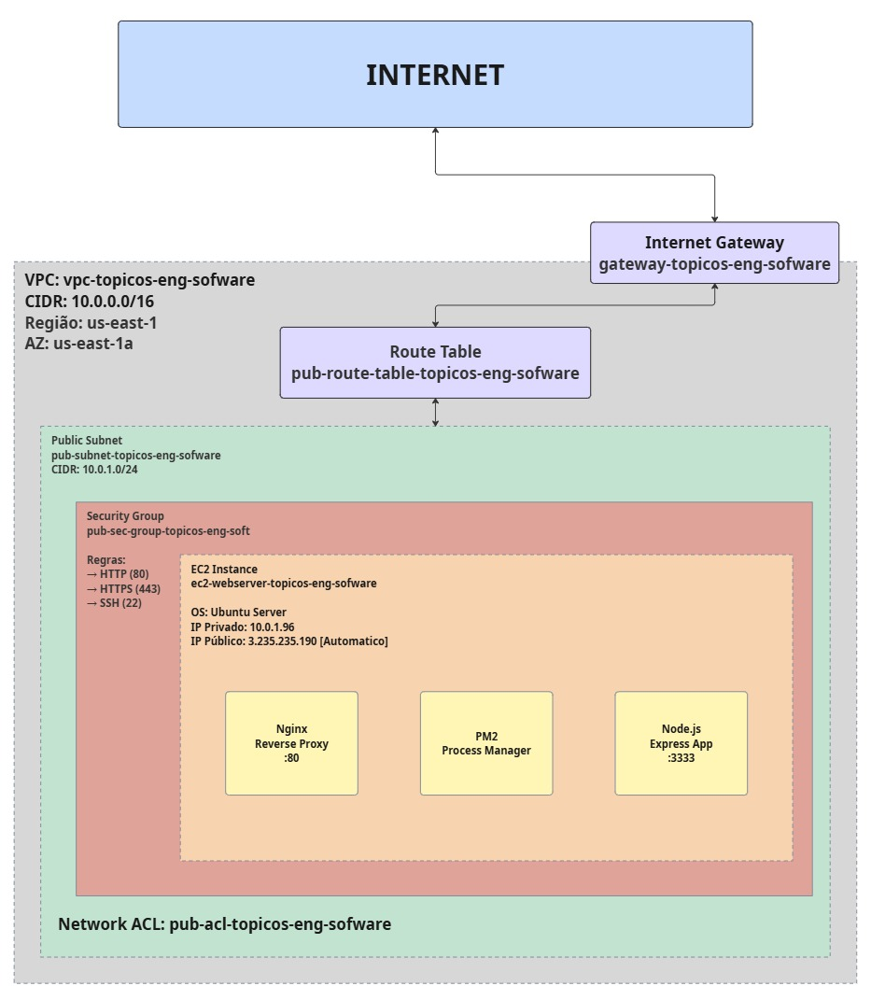

# AWS S33 Drives - Sistema de Autenticação

Protótipo de aplicação web com sistema completo de autenticação, gerenciamento de perfis e hospedagem na AWS.

## Sobre o Projeto

Este projeto foi desenvolvido como parte da disciplina DC-CCN071 e implementa uma aplicação web full-stack com foco em segurança, autenticação de usuários e infraestrutura em nuvem. A aplicação permite registro, login, edição de perfil e upload de imagens, tudo rodando em uma infraestrutura AWS configurada manualmente.

## Funcionalidades

### Autenticação e Autorização
- Registro de novos usuários com validação de email único
- Login seguro com geração de tokens JWT
- Proteção de rotas privadas
- Sistema de logout com limpeza de sessão

### Gerenciamento de Perfil
- Edição completa de informações pessoais (nome, username, email)
- Upload de foto de perfil com preview em tempo real
- Alteração de senha com validação de senha atual
- Campo de descrição pessoal (biografia)
- Visualização da data de criação da conta

### Dashboard
- Página principal após autenticação
- Exibição de todas as informações do usuário
- Acesso rápido para editar perfil
- Sistema de busca (preparado para futura integração com S3)

## Stack Tecnológica

**Backend:**
- Node.js 20.x
- Express.js 5.1.0
- Sequelize ORM 6.37.7
- SQLite3 5.1.7
- JWT para autenticação
- bcrypt para hash de senhas
- Multer para upload de arquivos

**Frontend:**
- HTML5, CSS3, JavaScript (Vanilla)
- Design responsivo com suporte a dark mode
- Sistema de navegação SPA (Single Page Application)

**Infraestrutura:**
- AWS VPC
- AWS EC2 (Ubuntu)
- Nginx como reverse proxy
- PM2 para gerenciamento de processos

## Arquitetura da Infraestrutura AWS

A aplicação está hospedada em uma infraestrutura AWS configurada seguindo as melhores práticas de segurança e isolamento de rede:



O diagrama acima ilustra a topologia completa da infraestrutura, incluindo:
- **Internet** conectada ao **Internet Gateway** para acesso público
- **VPC** isolada (vpc-topicos-eng-sofware) com CIDR 10.0.0.0/16 na região us-east-1
- **Route Table** configurada para direcionar tráfego entre Internet Gateway e a subnet
- **Public Subnet** (10.0.1.0/24) hospedando a instância EC2
- **Security Group** com regras de firewall (HTTP, HTTPS, SSH)
- **Network ACL** provendo segurança adicional no nível da subnet
- **Instância EC2** executando Ubuntu Server com IP privado 10.0.1.96
- **Stack de aplicação**: Nginx (porta 80) → PM2 → Node.js Express (porta 3333)

### Configuração do Nginx

O Nginx está configurado como reverse proxy para encaminhar requisições HTTP para a aplicação Node.js:

```nginx
server {
    listen 80;
    server_name _;

    access_log /var/log/nginx/aws-app-access.log;
    error_log /var/log/nginx/aws-app-error.log;

    location / {
        proxy_pass http://localhost:3333;
        proxy_http_version 1.1;
        proxy_set_header Upgrade $http_upgrade;
        proxy_set_header Connection 'upgrade';
        proxy_set_header Host $host;
        proxy_set_header X-Real-IP $remote_addr;
        proxy_set_header X-Forwarded-For $proxy_add_x_forwarded_for;
        proxy_set_header X-Forwarded-Proto $scheme;
        proxy_cache_bypass $http_upgrade;
    }
}
```

## Estrutura do Projeto

```
.
├── Backend/
│   ├── index.js                 # Servidor Express principal
│   ├── package.json             # Dependências do projeto
│   ├── config/
│   │   ├── database.js         # Configuração do SQLite
│   │   └── upload.js           # Configuração do Multer
│   ├── models/
│   │   └── User.js             # Model de usuário (Sequelize)
│   ├── script/
│   │   ├── initDB.js           # Script de inicialização do banco
│   │   └── uploadUser.js       # Utilitário para uploads
│   ├── database/
│   │   └── database.sqlite     # Banco de dados SQLite
│   └── uploads/                # Armazenamento de fotos de perfil
│
├── FrontEnd/
│   ├── index.html              # Estrutura HTML (SPA)
│   ├── index.css               # Estilos e design system
│   └── index.js                # Lógica de frontend
│
├── Checklist.md                # Lista de tarefas do projeto
└── README.md                   # Este arquivo
```

## Instalação e Uso

### Pré-requisitos

- Node.js 18.x ou superior
- npm ou yarn
- Git

### Rodando Localmente

1. Clone o repositório:
```bash
git clone https://github.com/rianteam22/DC-CCN071_ProtOtipo1-2a.Avaliacao-.git
cd DC-CCN071_ProtOtipo1-2a.Avaliacao-
```

2. Instale as dependências:
```bash
cd Backend
npm install
```

3. Crie o arquivo `.env` na pasta Backend:
```env
PORT=3333
JWT_SECRET=sua_chave_secreta_aqui
JWT_EXPIRES_IN=24h
```

4. Inicialize o banco de dados:
```bash
npm run init-db
```

5. Inicie o servidor:
```bash
npm run dev
```

6. Acesse a aplicação em `http://localhost:3333`

### Credenciais de Teste

Após rodar `npm run init-db`, um usuário padrão é criado:
- **Email:** c@c.com
- **Senha:** 123456

## API Endpoints

### Autenticação

**POST /register**
- Registra novo usuário
- Body: `{ "email": "usuario@email.com", "senha": "senha123" }`

**POST /login**
- Autentica usuário e retorna token JWT
- Body: `{ "email": "usuario@email.com", "senha": "senha123" }`

### Perfil (Rotas Protegidas)

**GET /profile/me**
- Retorna informações do usuário autenticado
- Header: `Authorization: Bearer {token}`

**GET /profile/photo/:uuid**
- Retorna a foto de perfil do usuário

**POST /profile/upload-photo**
- Upload de foto de perfil
- Header: `Authorization: Bearer {token}`
- Body: FormData com campo `profile_pic`

**PUT /profile/update**
- Atualiza informações do perfil
- Header: `Authorization: Bearer {token}`
- Body: `{ "name": "Nome", "user": "username", "description": "Bio", "novoEmail": "novo@email.com", "novaSenha": "novaSenha", "senhaAtual": "senhaAtual" }`

## Modelo de Dados

### Tabela Users

| Campo | Tipo | Descrição |
|-------|------|-----------|
| id | INTEGER | Chave primária (auto-incremento) |
| uuid | UUID | Identificador único universal |
| email | STRING | Email do usuário (único) |
| senha | STRING | Hash da senha (bcrypt) |
| user | STRING | Username (único, opcional) |
| name | STRING | Nome completo (opcional) |
| profile_pic | STRING | Caminho da foto de perfil |
| description | TEXT | Biografia do usuário (max 500 chars) |
| timestamp_created | DATE | Data de criação da conta |

## Segurança

- **Senhas:** Hash com bcrypt (10 salt rounds)
- **Autenticação:** JWT com expiração configurável
- **Validações:** Email e username únicos, senha mínima de 6 caracteres
- **Upload:** Apenas imagens permitidas (jpg, png, gif, webp) com limite de 5MB
- **Rotas Protegidas:** Middleware de autenticação JWT
- **CORS:** Configurado para aceitar requisições do frontend

## Deploy na AWS

A aplicação está configurada para rodar em produção na AWS seguindo estes passos:

1. **Configuração da VPC e Rede**
   - Criar VPC com CIDR apropriado
   - Configurar subnet pública
   - Anexar Internet Gateway
   - Configurar tabela de rotas

2. **Configuração da Instância EC2**
   - Lançar instância Ubuntu Server
   - Configurar Security Group (portas 22, 80, 443)
   - Atribuir IP público

3. **Instalação de Dependências**
- Conectar a instância
```bash
# Atualizar sistema
sudo apt update && sudo apt upgrade -y

# Instalar Node.js
curl -fsSL https://deb.nodesource.com/setup_20.x | sudo -E bash -
sudo apt install -y nodejs

# Instalar PM2
sudo npm install -g pm2

# Instalar Nginx
sudo apt install -y nginx
```

4. **Deploy da Aplicação**
```bash
# Clonar repositório
git clone https://github.com/rianteam22/DC-CCN071_ProtOtipo1-2a.Avaliacao-.git
cd DC-CCN071_ProtOtipo1-2a.Avaliacao-/Backend

# Instalar dependências
npm install

# Configurar variáveis de ambiente
nano .env

# Inicializar banco
npm run init-db

# Iniciar com PM2
pm2 start index.js --name aws-app
pm2 save
pm2 startup
```

5. **Configurar Nginx**
```bash
sudo nano /etc/nginx/sites-available/aws-app
sudo ln -s /etc/nginx/sites-available/aws-app /etc/nginx/sites-enabled/
sudo nginx -t
sudo systemctl restart nginx
```

## Equipe e Colaboração

Este projeto foi desenvolvido colaborativamente com as seguintes contribuições:

- **Infraestrutura AWS:** Configuração de VPC, EC2, Security Groups e Network ACLs (Rian)
- **Backend:** Desenvolvimento da API REST, autenticação JWT e integração com banco de dados (Carlos)
- **Frontend:** Interface de usuário, design system e integração com API (Carlos)
- **Deploy:** Configuração de Nginx, PM2 e ambiente de produção (Rian)
- **Documentação:** README, diagramas e especificações técnicas (Ambos)

## Licença

Este projeto foi desenvolvido para fins acadêmicos como parte da disciplina DC-CCN071.

## Contato

Repositório: [https://github.com/rianteam22/DC-CCN071_ProtOtipo1-2a.Avaliacao-](https://github.com/rianteam22/DC-CCN071_ProtOtipo1-2a.Avaliacao-)

---

